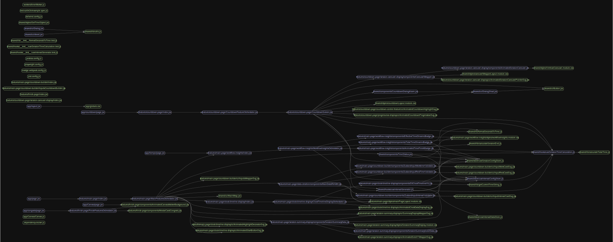

# Case Study: [Strongest Pomodoro Web]

[Version en español](./strongest-pomodoro-system.es.md)

## 🎯 Problem

In the search for methods to improve my productivity, I found the problem of not finding an app that would allow me to create enough pomodoros at once to finish my daily routine, without overdoing it, to make my productivity more sustainable over time.

## 🧩 Approach & Architecture

- Feature First Architecture: I migrated the project from React's default "component-based architecture" to Feature First. After about two weeks of work, this allowed me to add more features more easily and quickly, increasing my productivity.
  

- Tech choices: Next.js for the easy implementation of pagination and SSR

## 🚧 Challenges

- Migrating the project architecture
- Creating the component with D3.js and visualizing data in the form of a clock
- Aligning a complex design with a good user experience
- Creating native modules for React Native
- Making sure the timer could run and avoid tab throttling in the background
- Creating an adaptive (not just responsive) design, considering it would be both a web and a mobile app with bidirectional communication [Strongest Pomodoro Web] <-> [Strongest Pomodoro Mobile]

## 🔍 Solutions

- Migrating the project was definitely the most difficult challenge I faced. It was something I had never done before, but by researching and with the help of different AIs, especially ChatGpt, I not only achieved it, but also discovered and implemented the most suitable architecture for the project.

- The idea for the component came from HUD designs long before thinking about the implementation. I managed to implement it by reviewing some trigonometry topics to convert time to radians, D3 functionalities, and dividing each visualization into a small feature until I had the complete component.

- I had to find the balance between not overwhelming users and not getting stuck with an ugly minimalist design that I could have done in one day.

- The creation of native modules was not possible; I couldn't find a way or good documentation to implement them in the mobile app, so the mobile app is being developed with Kotlin. Even so, I managed to solve a problem now pointed out in the Expo CLI [Expo Modules - Bug NPM on trying to npx create-expo-module](https://github.com/expo/expo/issues/20624#issuecomment-2450869207)

- I implemented a web worker in charge of running the timer (I plan to improve it even more to avoid any problem or the user losing the timer)

- I had already achieved the solution before, at the beginning of my frontend development journey. It all has to do with using vw for creating grid columns and grid rows (CSS). I created a tool to make the workflow easier, I thought about making a Figma plugin using the ruler to make everything even easier, but Figma doesn't give us the ability to work with the ruler API (not as of July 2025)

## 📈 Results

- Improved ability to add more code, more features, debug, optimize, refactor
- Made an app with a better design, making it look like a futuristic sci-fi HUD
- Reduced the learning curve when using the app, making it very straightforward
- Experience to not use React Native for serious projects lol
- The timer kept running while I worked or studied, helping to avoid burnout or procrastination

## 🛠️ Next Steps

- Add an app tour
- Add ads
- Add freemium systems
- Migrate to TypeScript (for fun)
- Add Playwright
- Improve robustness on web
- Integrate a backend in Firebase or Supabase
- Integrate mobile app
